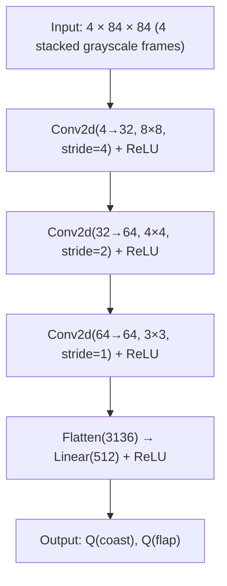

# BirdRL

A pixel-based Deep Q-Network (DQN) agent that learns to play Flappy Bird, built from scratch as a deep RL project. 

## Key Results

| Agent | Mean Score (pipes passed) | Mean Survival (steps) |
|-------|--------------------------|----------------------|
| Random | 0.00 | 38 |
| Heuristic | 0.34 | 128 |
| **DQN (trained)** | **~12.5** | **~970** |

## Architecture

## Environment Design

- **Action space:** Discrete(2) — coast or flap
- **Observations:** 4-frame stack of 84×84 grayscale pixel frames (channels-first, uint8)
- **Reward:** +5.0 per pipe passed, +0.02 per step survived, −1.0 on death
- **Termination:** Collision with pipe, ceiling, or floor
- **Truncation:** After 1000 steps (training) / 2000 steps (evaluation)

## Training Details

- **Algorithm:** DQN (Double DQN via Stable-Baselines3)
- **Device:** CPU
- **Training time:** ~8 hours per 1M steps
- **Replay buffer:** 50,000 transitions (uint8 for memory efficiency)
- **Exploration:** ε-greedy, decaying from 1.0 → 0.05

### Hyperparameters

| Parameter | Value |
|-----------|-------|
| Learning rate | 5e-5 |
| Batch size | 32 |
| Discount (γ) | 0.99 |
| Target network update | Every 5,000 steps |
| Replay buffer size | 50,000 |
| Exploration decay | 50% of training |
| Frame stack | 4 frames |